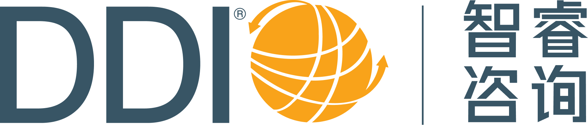

需求任务地址: 
https://devops.aliyun.com/projex/project/d489336a7297d8c4de499238c8/req/e24bf4021531842721140e733b

调整范围：
1. 界面logo （换成DDI Logo）
2. 功能模块的层级和名称调整

一期UI:
@.agents/prompts/assets/首页.生成新PPT.png
@.agents/prompts/assets/首页.美化现有PPT.png
我们需要按照这个设计对前端做适当改造. 

另外由于我们的sso登录也也缺少页面,而且没有UI设计,需要你帮忙做一下设计.

品牌logo在 @.agents/assets/ddi.cn.png

