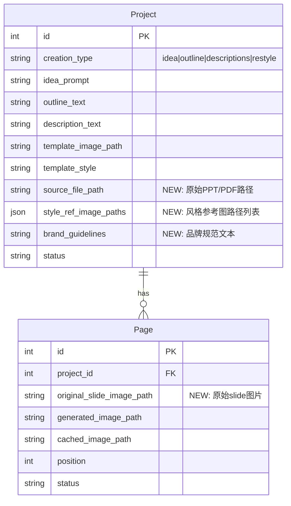

# ✨ feat: PPT Restyle — 上传已有PPT/PDF，AI逐页风格转换

## Overview

新增第4种创建模式 `restyle`，与现有 `idea`/`outline`/`description` 并列。用户上传已有PPT/PDF，提供风格参考截图+品牌规范文字，Agent 将源文件导出为逐页图片，利用 Gemini Image-to-Image 能力逐页重绘为新风格，最终合并为新的 PPTX。

```
┌──────────────────────────────────────────────────────────────┐
│                    Home Page (4 Tabs)                        │
│  [idea] [outline] [description] [restyle ← NEW]             │
└──────────────────────────────────────────────────────────────┘
                              │
              ┌───────────────┴───────────────┐
              │         Restyle Tab            │
              │                               │
              │  ① Upload PPT/PDF             │
              │  ② Upload style refs (1-N)    │
              │  ③ Brand guidelines text      │
              │  ④ [Start Restyle]            │
              └───────────────┬───────────────┘
                              │
                    ┌─────────▼─────────┐
                    │ PPT/PDF → Images  │  (LibreOffice + PyMuPDF)
                    └─────────┬─────────┘
                              │
                    ┌─────────▼─────────┐
                    │ Per-slide Restyle  │  (Gemini Image-to-Image)
                    │ old_slide + refs   │
                    │ → new_slide.png    │
                    └─────────┬─────────┘
                              │
                    ┌─────────▼─────────┐
                    │  SlidePreview     │  (复用现有预览/编辑页)
                    │  Review & Edit    │
                    └─────────┬─────────┘
                              │
                    ┌─────────▼─────────┐
                    │  Export PPTX/PDF  │  (复用现有导出)
                    └───────────────────┘
```

## Problem Statement / Motivation

现有 banana-slides 只支持"从零生成"PPT。但实际场景中，用户常有**已有的 PPT 需要美化/统一风格**：
- 公司品牌升级，旧PPT需要换新VI
- 多人协作PPT风格不一致，需要统一
- 拿到一个粗糙的PPT，想快速提升设计感
- 竞品演示文稿，想换成自己品牌风格

Gemini nano banana pro 的 Image-to-Image 能力天然适合这个场景。

## Proposed Solution

### 核心策略：Image-to-Image 重绘

```
contents = [
    <style_ref_1.png>,      # 风格参考图 (主)
    <style_ref_2.png>,      # 风格参考图 (辅, 可选)
    <original_slide.png>,   # 原始幻灯片 (内容来源)
    "<restyle_prompt>"      # 指令文本
]
→ Gemini generate_content → new_slide.png
```

**不做 OCR/内容提取**，直接让 Gemini 看原图+风格参考图重绘。原因：
1. 保留原始布局/图表/图片元素
2. 减少信息丢失
3. 利用 Gemini 强大的视觉理解能力
4. 实现简单，pipeline 短

## Technical Approach

### Phase 1: 文件上传与转换 (Backend)

#### 1.1 新增 `RestyleService`

```
backend/services/restyle_service.py
```

```python
class RestyleService:
    """PPT/PDF → slide images → restyle → new PPTX"""

    def convert_to_images(self, file_path: str, output_dir: str) -> list[str]:
        """将PPT/PDF转为逐页PNG图片"""
        ext = Path(file_path).suffix.lower()

        if ext in ('.ppt', '.pptx'):
            # Step1: LibreOffice headless → PDF
            # Step2: PyMuPDF → PNG (300dpi)
            return self._pptx_to_images(file_path, output_dir)
        elif ext == '.pdf':
            # 直接 PyMuPDF → PNG
            return self._pdf_to_images(file_path, output_dir)

    def restyle_slide(self,
                      original_slide_path: str,
                      style_ref_paths: list[str],
                      brand_guidelines: str,
                      page_index: int,
                      total_pages: int) -> Image.Image:
        """单页风格转换"""
        # 构建 prompt + ref_images → AIService.generate_image()

    def restyle_all_slides(self, project_id: int) -> str:
        """批量转换，返回 task_id (异步)"""
```

#### 1.2 PPT/PDF → Images 技术选型

```
Pipeline:  PPT/PPTX ──LibreOffice──→ PDF ──PyMuPDF──→ PNG[]
           PDF ─────────────────────────PyMuPDF──→ PNG[]
```

**新增依赖**:
```toml
# pyproject.toml
"pymupdf>=1.24.0"   # PDF → Images (极快, 无外部依赖)
```

**Docker 依赖** (已有 LibreOffice 或需新增):
```dockerfile
RUN apt-get update && apt-get install -y libreoffice-impress
```

#### 1.3 数据模型扩展

**Project Model** — 新增 `restyle` creation_type:

```python
# backend/models/project.py
class CreationType(str, Enum):
    IDEA = "idea"
    OUTLINE = "outline"
    DESCRIPTIONS = "descriptions"
    RESTYLE = "restyle"  # ← NEW

# 新增字段
source_file_path: str           # 上传的原始PPT/PDF路径
style_ref_image_paths: JSON     # 风格参考图路径列表 ["path1.png", "path2.png"]
brand_guidelines: str           # 品牌风格规范文本
```

**Page Model** — 新增字段:

```python
# 原始slide图片路径 (restyle模式专用)
original_slide_image_path: str  # 转换前的原始slide图片
```

#### 1.4 API Endpoints

```python
# backend/controllers/restyle_controller.py

# 创建restyle项目 (上传源文件+风格参考)
POST /api/projects/restyle
  Content-Type: multipart/form-data
  - source_file: File (PPT/PDF)
  - style_refs: File[] (1-N张风格参考截图)
  - brand_guidelines: str (可选文字描述)
  Response: { project_id, pages: [{id, original_slide_image_url}...] }

# 批量风格转换 (异步任务)
POST /api/projects/{id}/restyle/generate
  Body: { page_ids: int[] (可选, 默认全部) }
  Response: { task_id }

# 单页重新转换
POST /api/projects/{id}/pages/{page_id}/restyle/generate
  Response: { image_url }
```

### Phase 2: Restyle Prompt Engineering

#### 2.1 Prompt 模板

```python
# backend/services/prompts.py

def get_restyle_prompt(brand_guidelines: str,
                       page_index: int,
                       total_pages: int) -> str:
    return f"""
你是一位专业的PPT设计师。请根据提供的【风格参考图片】重新设计这张PPT页面。

## 任务
- 第一张/前几张图片是【目标风格参考】，请严格遵循其配色方案、字体风格、排版语言、装饰元素
- 最后一张图片是【原始PPT页面】，请保留其所有文字内容、数据和信息结构
- 用目标风格重新设计原始页面，保持内容不变

## 要求
- 完整保留原页面的所有文字(标题、正文、列表项、数据)
- 保留原页面的图表、图片等视觉元素(可以用新风格重绘)
- 采用风格参考图的: 配色、字体风格、背景、装饰元素、版式语言
- 输出16:9横版PPT页面
- 当前是第{page_index}/{total_pages}页，注意首页/尾页的特殊设计

{f'## 品牌规范\n{brand_guidelines}' if brand_guidelines else ''}
"""
```

#### 2.2 ref_images 传递顺序

```python
# 关键: Gemini contents 数组中图片的顺序影响权重
ref_images = [
    *style_ref_images,     # 风格参考在前 (权重高)
    original_slide_image,  # 原始slide在后 (内容来源)
]
# prompt 在最后
```

### Phase 3: 前端 UI

#### 3.1 Home 页新增 Restyle Tab

```
frontend/src/pages/Home.tsx
```

```
┌─────────────────────────────────────────────┐
│  [💡想法] [📝大纲] [📄描述] [🎨风格转换]     │
├─────────────────────────────────────────────┤
│                                             │
│  ┌─────────────────────────────────┐        │
│  │  📁 上传PPT/PDF                 │        │
│  │  拖拽文件到此处 或 点击选择      │        │
│  │  支持 .pptx .ppt .pdf           │        │
│  └─────────────────────────────────┘        │
│                                             │
│  ┌─────────────────────────────────┐        │
│  │  🎨 风格参考 (1-N张)            │        │
│  │  [+] 上传截图/模板缩略图        │        │
│  │  ┌──┐ ┌──┐ ┌──┐               │        │
│  │  │📷│ │📷│ │📷│               │        │
│  │  └──┘ └──┘ └──┘               │        │
│  └─────────────────────────────────┘        │
│                                             │
│  品牌风格说明 (可选):                        │
│  ┌─────────────────────────────────┐        │
│  │ 使用蓝色(#1E3A8A)为主色调...    │        │
│  └─────────────────────────────────┘        │
│                                             │
│           [🚀 开始风格转换]                  │
│                                             │
└─────────────────────────────────────────────┘
```

#### 3.2 Restyle 流程跳转

```
Home (restyle tab)
  → [开始风格转换]
  → 上传文件 → 等待转换 (PPT/PDF → images)
  → 显示原始slides预览 (可选择/排除页面)
  → [生成新风格] (异步任务)
  → 跳转 SlidePreview (复用现有组件)
    → 左侧: 原始slide / 右侧: 新风格slide
    → 可单页重新生成 / 编辑
    → 导出 PPTX/PDF
```

#### 3.3 新增组件

```
frontend/src/components/restyle/
├── SourceFileUploader.tsx     # PPT/PDF上传+拖拽
├── StyleRefUploader.tsx       # 风格参考图上传(多图)
├── OriginalSlideGrid.tsx      # 原始slide预览网格(带选择)
└── RestyleCompareView.tsx     # 对比视图(原始 vs 新风格)
```

#### 3.4 SlidePreview 页面复用

`SlidePreview.tsx` 已支持:
- ✅ 显示生成的图片
- ✅ 自然语言编辑(edit_image)
- ✅ 历史版本管理
- ✅ 导出 PPTX/PDF
- ✅ 批量/单页生成

**需扩展**:
- 对比视图: 原始slide缩略图 vs 新风格slide
- "重新转换"按钮(替代"重新生成")
- 原始slide作为额外参考传给 edit_image

### Phase 4: 异步任务集成

#### 4.1 复用现有 TaskManager

```python
# backend/services/task_manager.py — 新增 restyle 任务类型

def start_restyle_task(project_id, page_ids=None):
    """异步批量restyle"""
    task_id = create_task("restyle", project_id)

    def restyle_worker():
        pages = get_pages(project_id, page_ids)
        for page in pages:
            restyle_service.restyle_slide(
                original_slide_path=page.original_slide_image_path,
                style_ref_paths=project.style_ref_image_paths,
                brand_guidelines=project.brand_guidelines,
                page_index=page.position,
                total_pages=len(pages)
            )
            # 保存结果 → page.generated_image_path
            update_task_progress(task_id, completed=i+1, total=len(pages))

    executor.submit(restyle_worker)
    return task_id
```

前端轮询机制完全复用 `pollTaskStatus()`。

## ERD (数据模型变更)



## Acceptance Criteria

### Functional Requirements

- [x] 用户可在 Home 页选择 "restyle" Tab
- [x] 支持上传 .pptx / .ppt / .pdf 文件
- [x] 上传后自动将文件转换为逐页 PNG 图片
- [x] 支持上传 1-N 张风格参考截图
- [x] 支持输入品牌风格规范文字(可选)
- [x] 点击"开始风格转换"后，逐页调用 Gemini 重绘
- [x] 转换过程显示进度(复用现有 task 轮询)
- [x] 转换完成后跳转 SlidePreview 页面
- [x] 可在 SlidePreview 对比原始 vs 新风格
- [x] 可对单页进行自然语言编辑修改
- [x] 可重新转换不满意的页面
- [x] 支持导出为 PPTX / PDF

### Non-Functional Requirements

- [ ] PPT/PDF 转图片延迟 < 30s (20页以内)
- [ ] 单页 restyle 延迟 < 30s (取决于 Gemini API)
- [ ] 源文件大小限制: 50MB
- [ ] 风格参考图数量限制: 1-5张
- [ ] Docker 环境下正常工作(LibreOffice headless)

### Quality Gates

- [x] 后端新增 API 有单元测试覆盖
- [x] 前端 restyle 组件有基础测试
- [x] LibreOffice + PyMuPDF 在 Docker 中验证通过

## Implementation Phases

### Phase 1: 后端核心 — 文件转换 Pipeline (2-3天)

**目标**: PPT/PDF → Images 能力

- [x] 添加 `pymupdf` 依赖
- [x] 实现 `RestyleService.convert_to_images()` — `backend/services/restyle_service.py`
- [x] 更新 Dockerfile 确保 LibreOffice 可用
- [x] 扩展 Project/Page Model 新增字段 — `backend/models/project.py`, `backend/models/page.py`
- [x] 数据库迁移 — `backend/migrations/`
- [x] 实现 `POST /api/projects/restyle` API — `backend/controllers/restyle_controller.py`
- [x] 单元测试 — `backend/tests/test_restyle_service.py`

### Phase 2: 后端核心 — Restyle 生成 (2天)

**目标**: Image-to-Image 风格转换

- [x] 实现 restyle prompt 模板 — `backend/services/prompts.py`
- [x] 实现 `RestyleService.restyle_slide()` — 调用 `AIService.generate_image()`
- [x] 实现异步批量 restyle 任务 — `backend/services/task_manager.py`
- [x] 实现 `POST /api/projects/{id}/restyle/generate` API
- [x] 实现 `POST /api/projects/{id}/pages/{page_id}/restyle/generate` API

### Phase 3: 前端 UI (2-3天)

**目标**: Restyle 创建流程 + 预览

- [x] Home 页新增 restyle Tab — `frontend/src/pages/Home.tsx`
- [x] 实现 `SourceFileUploader` 组件 — `frontend/src/components/restyle/SourceFileUploader.tsx`
- [x] 实现 `StyleRefUploader` 组件 — `frontend/src/components/restyle/StyleRefUploader.tsx`
- [x] 实现 `OriginalSlideGrid` 组件 — `frontend/src/components/restyle/OriginalSlideGrid.tsx`
- [x] 添加 restyle API endpoints — `frontend/src/api/endpoints.ts`
- [x] Store 扩展支持 restyle 流程 — `frontend/src/store/useProjectStore.ts`
- [x] SlidePreview 页面增加原始slide对比视图

### Phase 4: 集成测试 & 优化 (1-2天)

- [x] 端到端测试: 上传PPT → restyle → 导出
- [x] Docker 环境集成测试
- [x] Prompt 调优 (多种PPT风格验证)
- [x] i18n 国际化 (中英文)
- [x] 错误处理 & 边界case

## Alternative Approaches Considered

| 方案 | 优点 | 缺点 | 决策 |
|------|------|------|------|
| **Image-to-Image 重绘** ✅ | 简单、保留布局、pipeline短 | 依赖Gemini视觉理解能力 | **采用** |
| 内容提取+重新生成 | 结构化数据可控 | OCR误差、图表丢失、pipeline长 | 否决 |
| 混合策略 | 灵活 | 复杂度高、维护成本大 | 可后期迭代 |

## Dependencies & Prerequisites

1. **LibreOffice** — Docker 镜像需包含 `libreoffice-impress`
2. **PyMuPDF** — 新增 Python 依赖
3. **Gemini API** — 已有，复用 `AIService`
4. **python-pptx** — 已有，复用导出功能

## Risk Analysis & Mitigation

| 风险 | 影响 | 缓解措施 |
|------|------|----------|
| Gemini 重绘后文字内容丢失/变形 | 高 | Prompt 强调"精确保留所有文字"; Thinking模式提升准确度 |
| LibreOffice 转换质量不稳定 | 中 | 设置 300dpi; 测试各种PPT模板 |
| 大文件上传超时 | 中 | 50MB限制; 分块上传; 进度显示 |
| Docker 镜像体积增大 | 低 | LibreOffice 约 500MB; 可接受 |
| 多风格参考图权重不均 | 中 | Prompt 明确标注"第1张为主风格"; 后续可加权重控制 |

## Future Considerations

1. **局部风格转换** — 只转换选定页面，其余保持原样
2. **风格预览** — 先转换1页预览效果，再决定是否全部转换
3. **模板库** — 常用风格模板预设，一键选择
4. **批量项目** — 多个PPT文件批量风格统一
5. **内容提取模式** — 高级模式支持 OCR + 结构化重生成

## References & Research

### Internal References
- 现有图片生成: `backend/services/ai_service.py:generate_image()`
- Gemini Provider: `backend/services/ai_providers/genai_provider.py`
- 导出服务: `backend/services/export_service.py`
- Task Manager: `backend/services/task_manager.py`
- Project Model: `backend/models/project.py`
- Page Model: `backend/models/page.py`
- Home页: `frontend/src/pages/Home.tsx`
- SlidePreview页: `frontend/src/pages/SlidePreview.tsx`
- API endpoints: `frontend/src/api/endpoints.ts`

### External References
- PyMuPDF docs: https://pymupdf.readthedocs.io/
- LibreOffice headless: https://help.libreoffice.org/latest/en-US/text/shared/guide/start_parameters.html
- python-pptx: https://python-pptx.readthedocs.io/
- Gemini image generation: https://ai.google.dev/gemini-api/docs/image-generation
