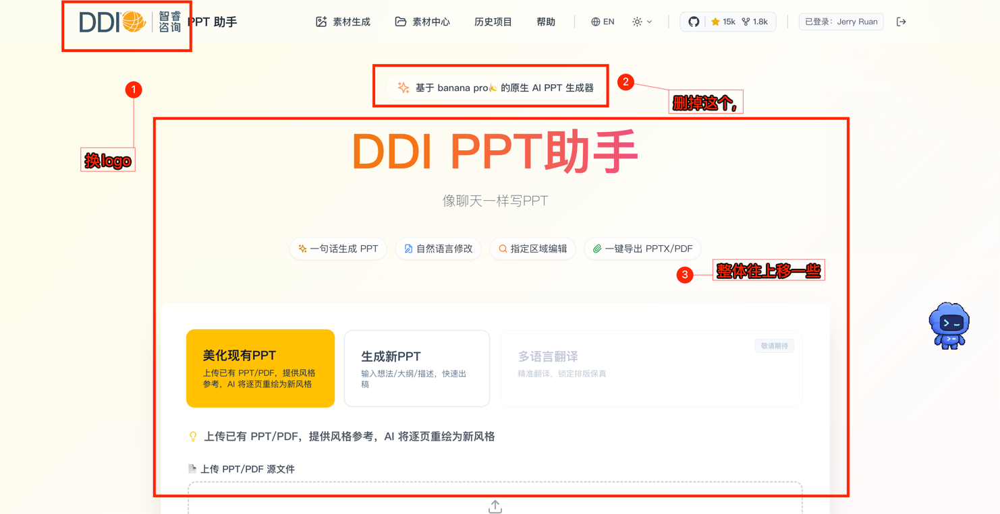

1. 首页调整: 

如截图所示的调整外, 顶部的帮助菜单, github状态 , 以及底部的github链接需要去掉
logo换成 这个

2. 生成新PPT 工作流的全链路调整

参考这里的原型 @docs/requirements/202606/ddi_ppt_assistant.html
我们需要在 生成新PPT工作流下的三个场景都按照跟 美化现有PPT一样, 能够接受: 1.风格参考图 + 2.风格文字描述 + 需求内容(主题 or 大纲 or 定稿文案)
生成新PPT的环节,预置的Prompt参考 @docs/requirements/202606/生成新ppt prompt.md

另外 restyle环节的预置提示词可以调整为 @docs/requirements/202606/优化现有ppt prompt.md 吗?

我感觉这个部分比较复杂,需要你好好梳理代码后先给我方案